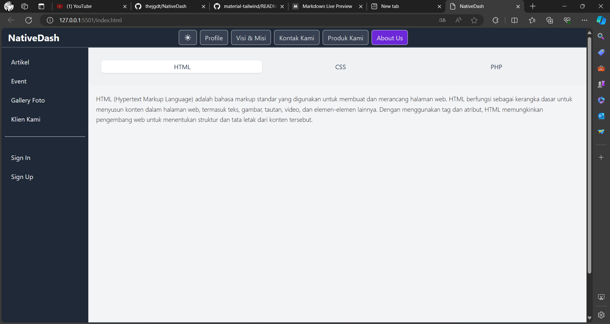
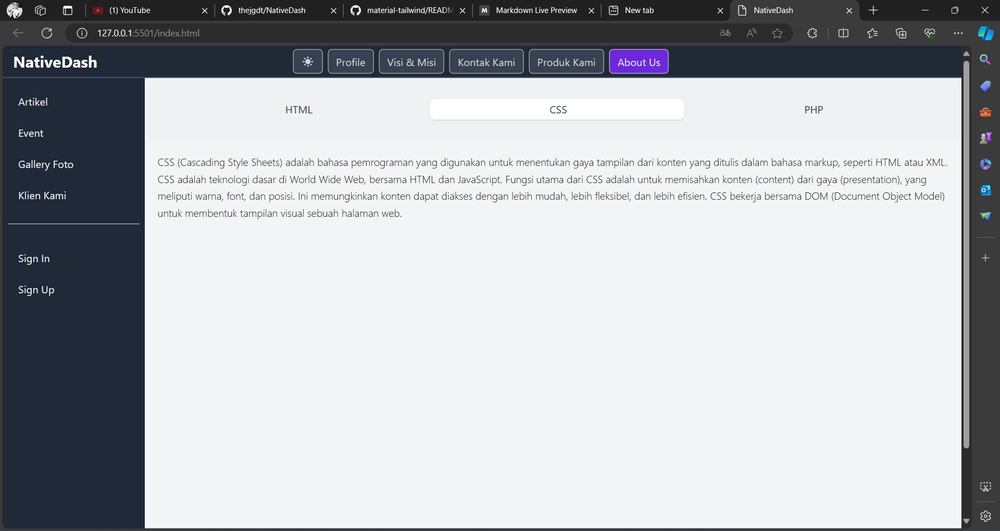

# NativeDash - Work In Progress

## Description

NativeDash Project is a project that has admin dashboard features. This project is intended to make it easier to manage data and information in an application.

## Features

- User registration and login (Coming soon)
- Data management and manipulation (Coming soon)
- User permission and access control (Coming soon)
- Real-time data monitoring (Coming soon)

## Installation

1. Clone the repository to your local machine
```
git clone https://github.com/thejgdt/NativeDash.git
```
and start customizing the website

## Built With

- HTML
- CSS
- PHP

## Preview
### Components

<table>
  <tr>
    <td width="33.3333%">HTML</td>
    <td width="33.3333%">CSS</td>
    <td width="33.3333%">PHP</td>
  </tr>
  <tr>
    <td width="33.3333%" style="padding: 0;">
        
    </td>
    <td width="33.3333%" style="padding: 0;">
        
    </td>
    <td width="33.3333%" style="padding: 0;">
        
    </td>
  </tr>
</table>

<br />

## Authors

- **Jagaddhita** - [thejgdt](https://github.com/thejgdt)

## Credit(s)

- **Tailwind CSS** - [tailwindcss.com](https://tailwindcss.com)
- **Material Tailwind** - [material-tailwind.com](https://www.material-tailwind.com/)

## License

This project is licensed under the MIT License - see the [LICENSE](LICENSE) file for details